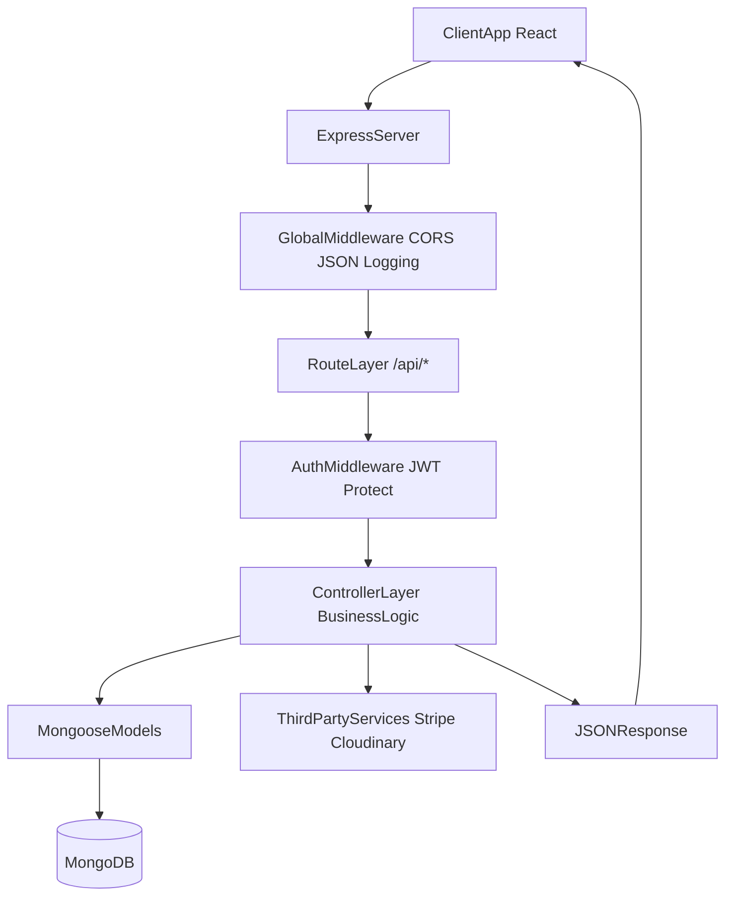
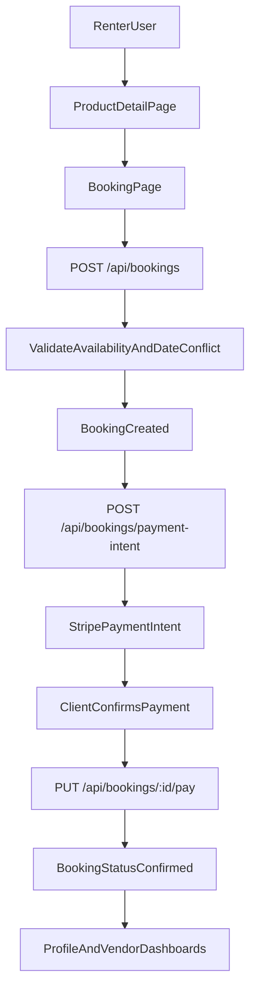
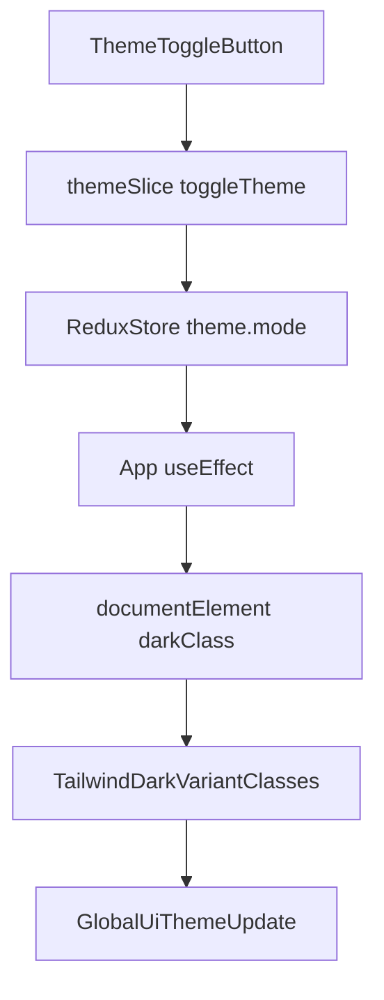

# InstaRental Professional Project Explanation

## 1) Project Overview

InstaRental is a full-stack rental marketplace where users can list products for rent, discover items by category/location, book them for specific dates, and complete payments securely.  
The platform supports three roles:

- **Renter**: browse products, create bookings, pay, review, and chat.
- **Vendor**: create/manage listings and handle received bookings.
- **Admin**: monitor users/products/bookings and manage platform operations.

### Business Problem Solved

Many people own underused products while others need short-term access. InstaRental creates a structured digital marketplace that improves utilization, trust, and transaction safety.

---

## 2) Tech Stack and Why It Is Used

## Frontend

- **React + Vite** (`frontend/package.json`)  
  React provides component-driven UI architecture; Vite gives fast development and optimized production builds.

- **React Router DOM** (`frontend/src/App.jsx`)  
  Handles SPA routing with clean URL-based navigation and protected route patterns.

- **Redux Toolkit + React Redux** (`frontend/src/store/store.js`)  
  Centralized predictable state management for auth, products, bookings, wishlist, and theme.

- **redux-persist** (`frontend/src/main.jsx`, `frontend/src/store/store.js`)  
  Persists key client state (especially auth) across refresh for better UX.

- **Tailwind CSS (class-based dark mode)** (`frontend/tailwind.config.js`)  
  Enables rapid, consistent design implementation with utility-first classes and global theme switching via `dark` class.

- **Axios** (`frontend/src/api/axiosConfig.js`)  
  Standardized API client layer with request configuration/interceptors for token-based requests.

- **Stripe React SDK** (`frontend/package.json`, booking flow pages)  
  Provides secure card/payment UI integration with backend payment intents.

## Backend

- **Node.js + Express** (`backend/server.js`)  
  Lightweight and flexible API framework for modular route/controller architecture.

- **MongoDB + Mongoose** (`backend/config/db.js`, `backend/models/*`)  
  Document-oriented storage fits evolving marketplace entities and relationships.

- **JWT Authentication** (`backend/middleware/authMiddleware.js`)  
  Stateless, scalable authorization model for API access.

- **bcryptjs** (`backend/models/User.js`)  
  Secure password hashing and credential verification.

- **Multer + Cloudinary** (`backend/middleware/uploadMiddleware.js`)  
  Handles product image upload with local fallback and cloud storage capability.

- **Stripe** (`backend/controllers/bookingController.js`)  
  Secure payment intent creation and payment confirmation lifecycle.

---

## 3) High-Level Architecture

### Frontend Architecture

- Entry point: `frontend/src/main.jsx` mounts app inside Redux `Provider` and `PersistGate`.
- App shell: `frontend/src/App.jsx` provides layout (`Navbar`, `Footer`, `AIChatBot`) and route tree.
- State layer: `frontend/src/store/store.js` combines slices:
  - `auth`, `products`, `bookings`, `wishlist`, `theme`.
- UI layer: pages and reusable components consume store state and dispatch async actions.

### Backend Architecture

- App bootstrap and middleware chain in `backend/server.js`.
- API modules mounted under `/api/*` route namespaces.
- Standard layering:
  - **Routes** (`backend/routes/*`) -> endpoint definitions and middleware usage.
  - **Controllers** (`backend/controllers/*`) -> business logic.
  - **Models** (`backend/models/*`) -> data schema and persistence.
  - **Middleware** (`backend/middleware/*`) -> auth, upload, error handling.

### Core Data Models

- **User**: identity, role, auth, wishlist, status.
- **Product**: listing details, owner, pricing, availability, booked date ranges.
- **Booking**: renter-owner transaction record with dates, status, and payment state.
- **Review**: product feedback and rating aggregation support.
- **Message**: booking-linked communication between renter and owner.

---

## 4) End-to-End Flow of the Project

## A) Authentication and Session Flow

1. User registers/logs in from frontend forms.
2. Backend validates credentials and returns JWT.
3. Frontend stores auth state in Redux (persisted across refresh).
4. Protected routes validate `state.auth.user` before rendering private pages.

## B) Product Discovery Flow

1. Homepage and product listing pages request catalog data.
2. Product filters (city/price/category/sort) are applied via product APIs.
3. User opens product details for pricing, owner info, reviews, and availability.
4. User can wishlist items or proceed to booking.

## C) Booking + Payment Flow

1. User selects booking dates.
2. Backend validates product availability and date conflicts.
3. Booking record is created and dates are reserved on product.
4. Backend creates Stripe payment intent for booking amount.
5. Frontend confirms payment; backend marks booking `paid/confirmed`.
6. Product rental counters and booking status are updated.

## D) Messaging Flow

1. After booking context exists, renter and owner can chat.
2. Messages are stored with booking references.
3. Message read/unread states support conversational tracking.

## E) Role-Based Operational Flow

- **Vendor**: manages own listings and booking requests.
- **Admin**: monitors aggregate platform activity and performs management actions.

---

## 5) System Flow Diagrams

## Overall Request Lifecycle

## Booking and Payment Lifecycle

## Theme Flow (Dark/Light)

---

## 6) Why This Architecture Works Well

- **Clear separation of concerns** keeps frontend rendering, business logic, and persistence maintainable.
- **Role-based access controls** enforce platform safety for multi-user workflows.
- **Centralized state management** improves consistency across pages and features.
- **Scalable modular routing** allows adding future modules (notifications, analytics, subscriptions) with minimal disruption.
- **Payment + upload integrations** solve critical real-world marketplace requirements.

---

## 7) Professional 60-90 Second Explanation Script

InstaRental is a full-stack rental marketplace built with React, Redux Toolkit, Tailwind, and an Express-MongoDB backend.  
On the frontend, we use Redux slices for auth, products, bookings, wishlist, and theme, which keeps state predictable and scalable. Routing is handled through protected routes so only authorized users can access private pages such as booking, vendor dashboard, or admin panel.  
On the backend, we follow a modular route-controller-model architecture with JWT-based authentication and role authorization for renter, vendor, and admin permissions.  
The core business flow is: discover products, check availability, create booking, generate Stripe payment intent, confirm payment, and then manage fulfillment through dashboards and booking-linked messaging.  
The project is production-oriented because it includes secure auth, payment integration, media upload support, error middleware, and role-based governance in one coherent architecture.

---

## 8) Key Strengths, Scalability Points, and Future Enhancements

## Key Strengths

- End-to-end transactional flow from catalog discovery to secure payment.
- Strong role separation for renter/vendor/admin operations.
- Reusable component and slice structure for maintainable frontend growth.
- Professional UX baseline with global theme support and standardized UI patterns.

## Scalability Points

- Add caching/read optimization for high-traffic product queries.
- Introduce background workers for notifications and asynchronous tasks.
- Expand analytics aggregation for vendor/admin insights.
- Move toward service-level modularization if domain complexity grows.

## Future Enhancements

- Real-time messaging with websockets.
- Advanced recommendation/personalization engine.
- Multi-currency + tax-invoice support.
- Notification center (email/SMS/in-app) for booking lifecycle events.
